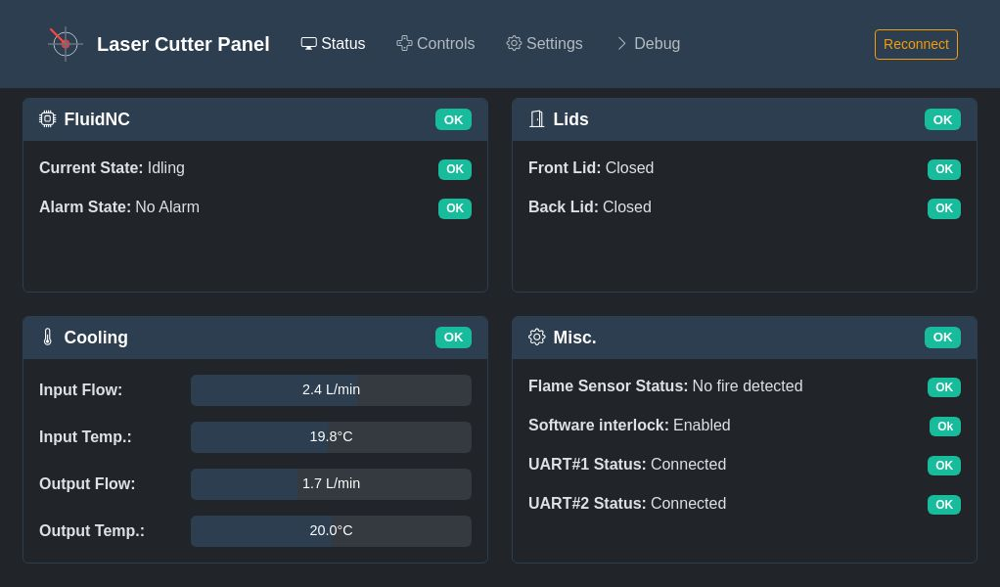
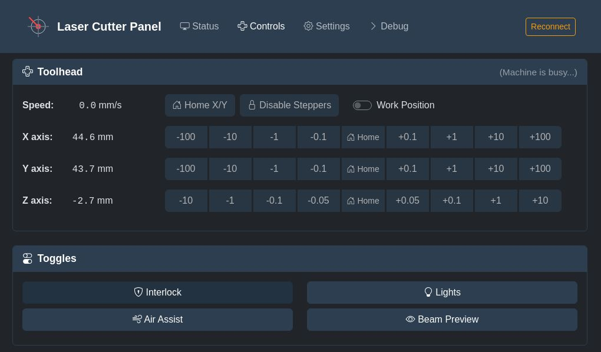

<h1 align="center">Phosphoros</h1>

<p align="center"><i>Raspberry Pi display for the <a href="https://github.com/Lyrkan/K40-Control-Panel">K40 Control Panel</a></i></p>


<p align="center">
     
    
</p>

<p align="center">
    <a title="License" href="https://github.com/Lyrkan/Phosphoros/blob/master/LICENSE"></a>
    
    <a title="Last release"></a>
</p>

## Setup on a Raspberry Pi 4

The following instructions are for a Raspberry Pi 4 running Ubuntu Server 24.04.

__Install all required dependencies:__

```
$ sudo sed -i 's/dtoverlay=dwc2/dtoverlay=vc4-kms-v3d-pi4/g' /boot/firmware/config.txt
$ sudo snap install ubuntu-frame
$ sudo snap install frame-it --classic
$ sudo snap install ubuntu-frame-osk
$ sudo snap connect ubuntu-frame-osk:wayland
$ sudo snap set frame-it osk=enable
$ sudo apt-get install zlib1g-dev libfuse2 libatk1.0-0 libnss3-dev libatk-bridge2.0-0 libgdk-pixbuf2.0-0 libgtk-3-0 libgbm1 libasound2t64 libegl1 libgl1-mesa-dri raspi-config
$ sudo snap set ubuntu-frame config="
wallpaper-top=0x003366
wallpaper-bottom=0x004080
"
$ sudo reboot
```

__Download the latest release:__

```
$ wget https://github.com/Lyrkan/Phosphoros/releases/download/experimental/phosphoros-1.0.0-arm64.AppImage
$ chmod +x phosphoros-1.0.0-arm64.AppImage
$ sudo mv phosphoros-1.0.0-arm64.AppImage /usr/local/bin/phosphoros
```

__Test that it works using frame-it:__

```
$ frame-it phosphoros --enable-features=UseOzonePlatform --ozone-platform=wayland --enable-wayland-ime
```

__Create a user for the application:__

```
$ sudo useradd kiosk -m
$ sudo passwd kiosk 
$ sudo usermod -a -G input,audio,video,render,gpio,dialout kiosk
$ sudo systemctl edit --full --force user-session.service

[Service]
User=kiosk
PAMName=login
TTYPath=/dev/tty1
ExecStart=/usr/bin/systemctl --user start --wait user-session.target
Restart=always

$ ssh kiosk@localhost
$ systemctl --user edit --full --force ubuntu-frame.service

[Unit]
BindsTo=graphical-session.target
[Service]
ExecStartPre=/usr/bin/dbus-update-activation-environment --systemd WAYLAND_DISPLAY=wayland-0
ExecStart=/snap/bin/frame-it phosphoros --enable-features=UseOzonePlatform --ozone-platform=wayland --enable-wayland-ime


$ systemctl --user edit --full --force user-session.target

[Unit]
Wants=ubuntu-frame.service

$ exit
$ sudo systemctl add-wants graphical.target user-session.service
$ sudo passwd -d 'kiosk'
```

__Enable UART:__

Enter raspi-config:

```
$ sudo raspi-config
```

When asked, select:

* Interfacing Options
* Serial port
  * Login shell? No
  * Serial port hardware? Yes

Then edit the `/boot/firmware/config.txt` file:

```
$ sudo nano /boot/firmware/config.txt
```

And add or set the following line:

```
dtoverlay=disable-bt
enable_uart=1
```

Reboot: `sudo reboot`
